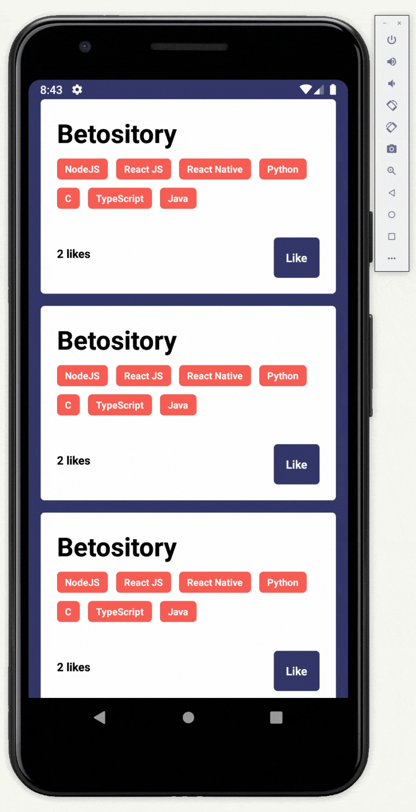

# ⚛ React Native Concepts Study

Mobile app that makes requests to server to show and like repositories.

### 📺 Preview



### 📟 Technologies

- [React Native](https://reactnative.dev/)
- [Axios](https://github.com/axios/axios)
- [Android Studio Emulator](https://developer.android.com/studio)

### ⚙ Instructions

The API used is [Here](https://github.com/Betorresmo/node-concepts-challenge)

<b>To install dependencies:</b>
```
$ yarn install
```
<b>To compile:</b>
```
$ yarn start
```
<b>To start the android emulator:</b>
```
$ yarn android
```

## 📬 [Contact me](https://www.linkedin.com/in/guerrero-roberto/)
